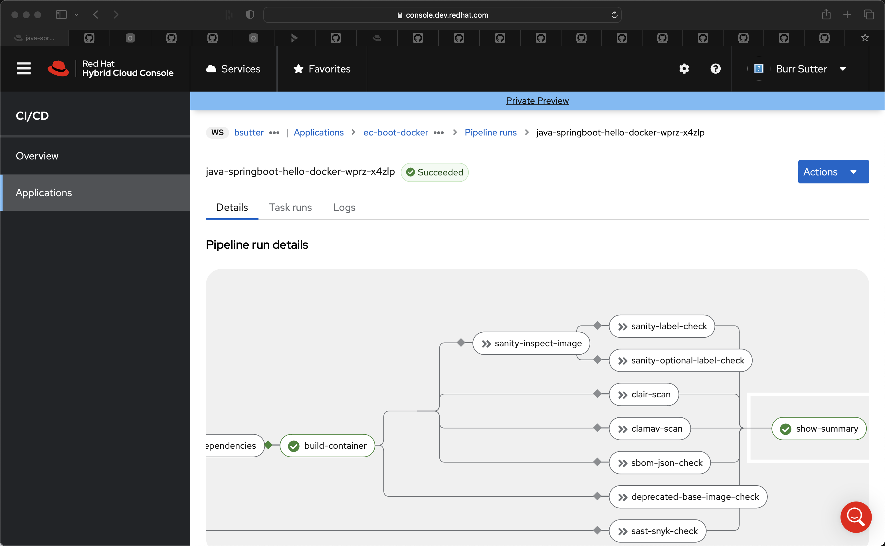
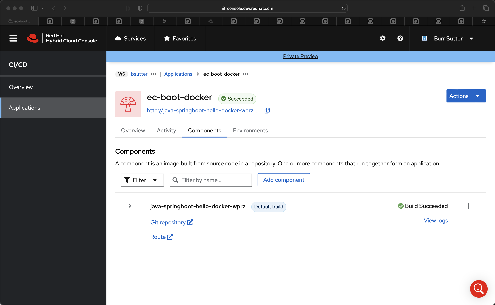
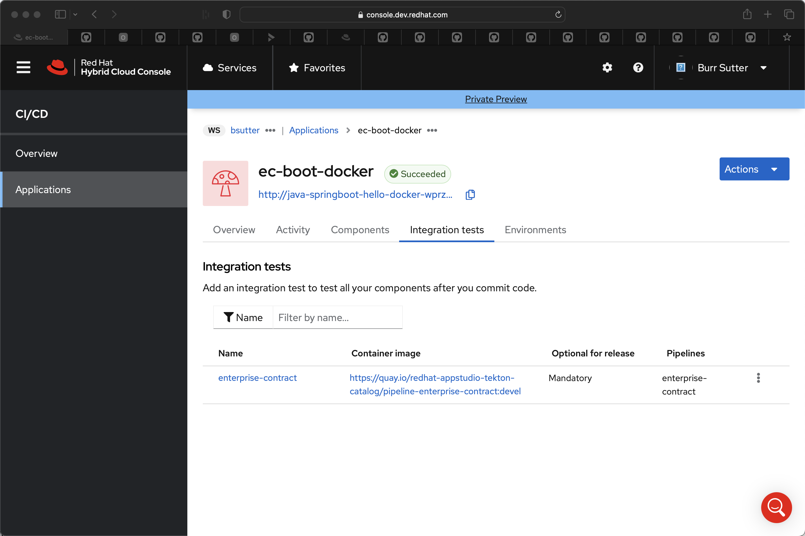
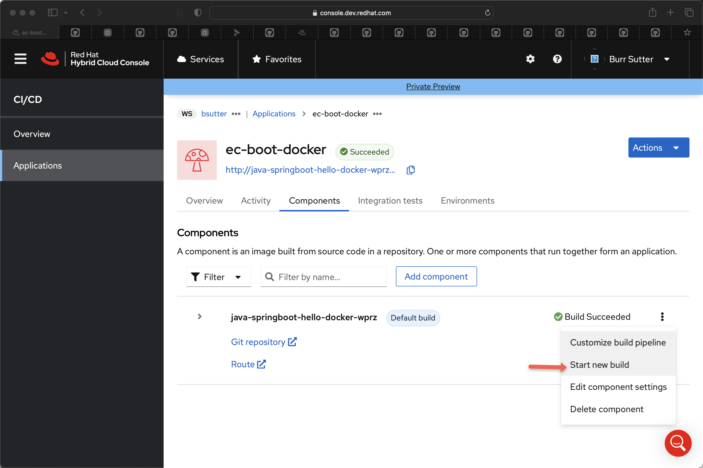
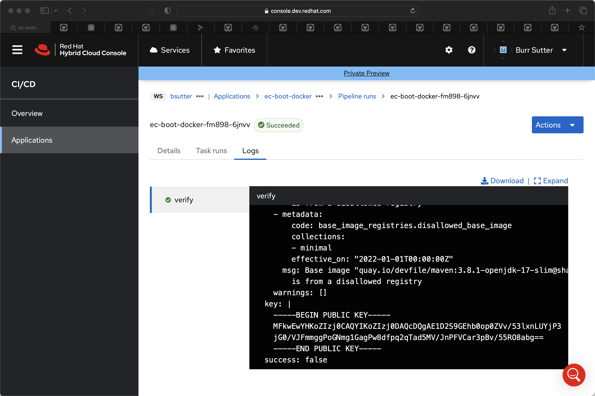

# Base Image Registries

For this github repository

https://github.com/burrsutter/java-springboot-hello-docker

Includes a Dockerfile and the goal here is to see if the Enterprise Contract can block based on `disallowed registry` rule

Using the GUI, create the `ec-boot-docker` application and Component for `https://github.com/burrsutter/java-springboot-hello-docker`






```
curl http://java-springboot-hello-docker-wprz-bsutter-tenant.apps.stone-stg-m01.1ion.p1.openshiftapps.com
```

```
Hello 7 2-19-2023 08:03:53 on java-springboot-hello-docker-wprz-57666dcd6b-tmx6w
```

```
kubectl replace -f ec-policy-minimal.yaml
```

```
kubectl apply -f ec-integrationtest.yaml
```

Set the flag to make Integration Tests visible

https://console.dev.redhat.com/hac/stonesoup?mvp=false








### Testing policy definitions via ec CLI

Grab Component's image

```
CONTAINERIMAGE=$(oc get component ec-node-hello-d4m7 -oyaml | yq .spec.containerImage)
echo $CONTAINERIMAGE
```

Convert Yaml to JSON

```
ECPOLICY=$(kubectl create --dry-run=client -o jsonpath='{.spec}' -f ec-policy.yaml)
```

Feed into ec CLI

```
ec validate image --image $CONTAINERIMAGE --policy $ECPOLICY --output yaml
```

```
components:
- containerImage: quay.io/redhat-appstudio/user-workload@sha256:bfc2f032f45fc6458856e7788ab61165282c519cee17dc2c61af5123c54ced3b
  name: Unnamed
  signatures:
  - keyid: SHA256:XYKS3l5z/5Lb69ghfJkB8aLlQgAAPjyQu6p8Dzo9VAw
    metadata:
      predicateBuildType: tekton.dev/v1beta1/TaskRun
      predicateType: https://slsa.dev/provenance/v0.2
      type: https://in-toto.io/Statement/v0.1
    sig: MEQCIGw28ZU1j7zv3icmeEnWyilgXVZF2uomLsScKlWgai+1AiAD/RnHNI5h0iiJbN6K29B1a7dutX+L6wFYF+7dcZfOTg==
  - keyid: SHA256:XYKS3l5z/5Lb69ghfJkB8aLlQgAAPjyQu6p8Dzo9VAw
    metadata:
      predicateBuildType: tekton.dev/v1beta1/PipelineRun
      predicateType: https://slsa.dev/provenance/v0.2
      type: https://in-toto.io/Statement/v0.1
    sig: MEUCIHA8BzAz4yAxbKb3Zg0WiW0jVPNSHXl4VapwT3eu9UWfAiEAgiWZdT46mNJodLPMpBCgFaCm3MaVvVlE7O1/2ngVQpM=
  - keyid: SHA256:XYKS3l5z/5Lb69ghfJkB8aLlQgAAPjyQu6p8Dzo9VAw
    metadata:
      predicateBuildType: tekton.dev/v1beta1/PipelineRun
      predicateType: https://slsa.dev/provenance/v0.2
      type: https://in-toto.io/Statement/v0.1
    sig: MEQCIC7/kB/mTjSg0yaOJ87HeDnLowBPuf/LewLwViFIPLTrAiBRx4KJwU+BWxfCn9ySga/f+PdpD8htN1OaFUbH5XfrGw==
  success: false
  violations:
  - metadata:
      code: test.test_data_missing
      effective_on: "2022-01-01T00:00:00Z"
    msg: No test data found
  - metadata:
      code: buildah_build_task.dockerfile_param_external_source
      effective_on: "2022-01-01T00:00:00Z"
    msg: DOCKERFILE param value (https://raw.githubusercontent.com/nodeshift-starters/devfile-sample/main/Dockerfile)
      is an external source
  - metadata:
      code: hermetic_build_task.build_task_not_hermetic
      effective_on: "2022-01-01T00:00:00Z"
    msg: Build task was not invoked with hermetic parameter
  - metadata:
      code: tasks.missing_required_task
      effective_on: "2022-01-01T00:00:00Z"
      term: clair-scan
    msg: Required task "clair-scan" is missing
  - metadata:
      code: tasks.missing_required_task
      effective_on: "2022-01-01T00:00:00Z"
      term: clamav-scan
    msg: Required task "clamav-scan" is missing
  - metadata:
      code: tasks.missing_required_task
      effective_on: "2022-01-01T00:00:00Z"
      term: prefetch-dependencies
    msg: Required task "prefetch-dependencies" is missing
  - metadata:
      code: tasks.missing_required_task
      effective_on: "2022-01-01T00:00:00Z"
      term: sanity-inspect-image
    msg: Required task "sanity-inspect-image" is missing
  - metadata:
      code: tasks.missing_required_task
      effective_on: "2022-01-01T00:00:00Z"
      term: sanity-label-check
    msg: Required task "sanity-label-check" is missing
  - metadata:
      code: tasks.missing_required_task
      effective_on: "2022-01-01T00:00:00Z"
      term: sast-snyk-check
    msg: Required task "sast-snyk-check" is missing
  warnings:
  - metadata:
      code: tasks.missing_required_pipeline_task_warning
      effective_on: "2022-01-01T00:00:00Z"
    msg: Required tasks do not exist for pipeline
key: |
  -----BEGIN PUBLIC KEY-----
  MFkwEwYHKoZIzj0CAQYIKoZIzj0DAQcDQgAE1D2S9GEhb0op0ZVv/53lxnLUYjP3
  jG0/VJFmmggPoGNmg1GagPw8dfpq2qTad5MV/JnPFVCar3pBv/55RO8abg==
  -----END PUBLIC KEY-----
success: false
```