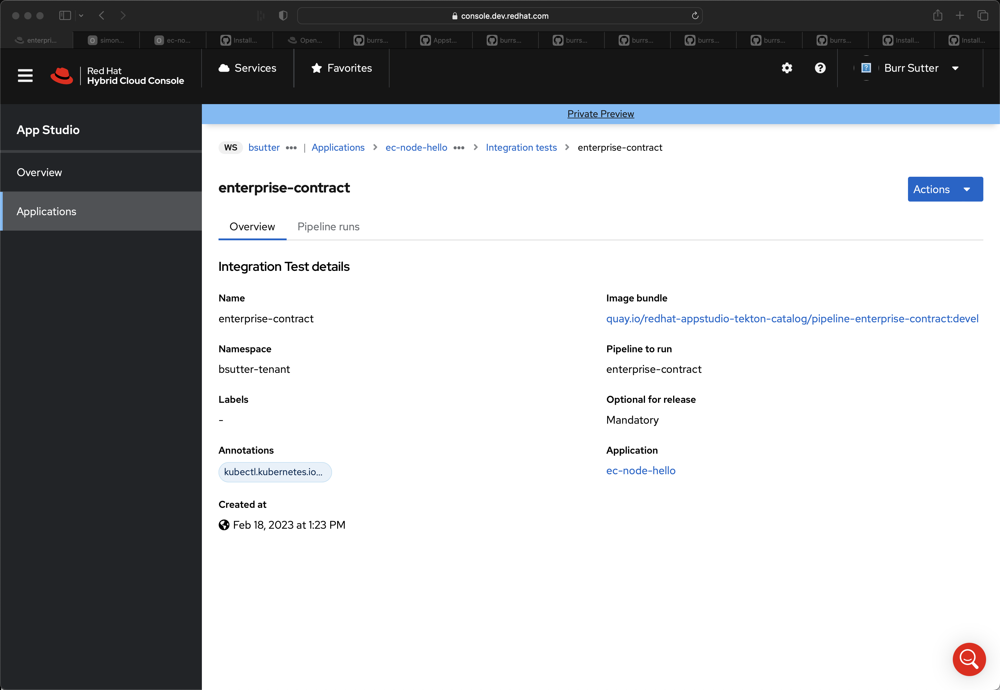
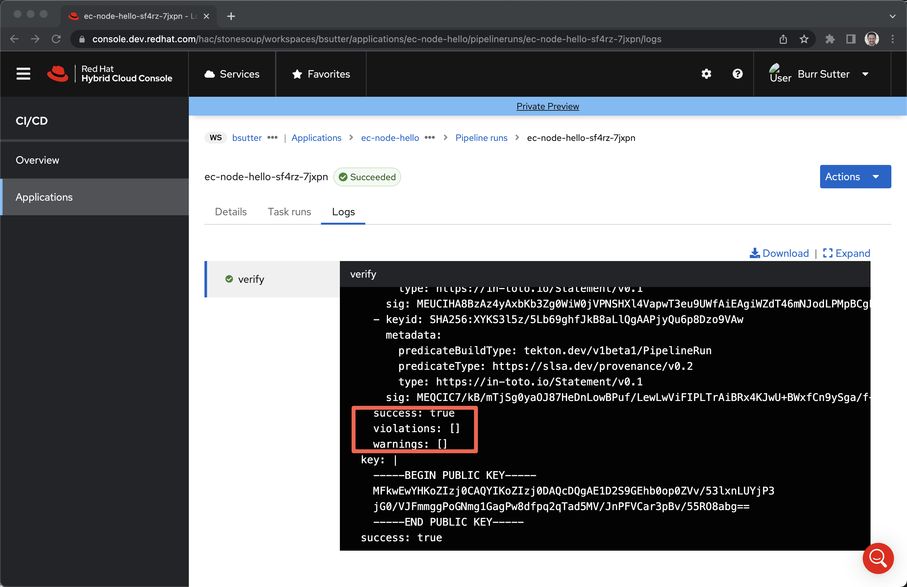

# Hello World

The goal is to start with an unrestrictive EC policy and upgrade to a more restrictive one. 

Uses this codebase

https://github.com/burrsutter/ec-node-hello

And applies various EC policies against the container image produced by Stonesoup

What policy is in the cluster today?

```
oc get -n enterprise-contract-service enterprisecontractpolicy default -o yaml | yq .spec
```

```
configuration:
  collections:
    - minimal
description: |
  Default EnterpriseContractPolicy. If a different policy is desired, this resource can serve as a starting point.
publicKey: k8s://tekton-chains/public-key
sources:
  - data:
      - oci::https://quay.io/hacbs-contract/ec-policy-data:latest@sha256:2321f0c6e9367d9e203dfbd17455cb0238d4c9b55e61e11ab659948d9bb8af9e
    name: Default Policies
    policy:
      - oci::https://quay.io/hacbs-contract/ec-release-policy:latest@sha256:7779b9074fd58693fda5657422be1b025b876a880c058a29360b8383a511f687
```

### Create ec CLI

```
cd ~/projects

git clone https://github.com/hacbs-contract/ec-cli.git

cd ec-cli

make build
```

### Add CLI to path

```
export PATH=/Users/burr/projects/ec-cli/dist:$PATH
```

### Test CLI

```
ec
```

The following help output is displayed

```
Enterprise Contract CLI

Set of commands to help validate resources with the Enterprise Contract.

Usage:
  ec [command]

Available Commands:
  completion  Generate the autocompletion script for the specified shell
  create-pr   Create a GitHub pull request based on source and target branches
  fetch       Fetch policies and authorization data
  help        Help about any command
  inspect     Inspect policy rules
  replace     Replace image references in a given source
  track       Record resource references for tracking purposes
  validate    Validate conformance with the Enterprise Contract
  version     Print version information

Flags:
      --debug               same as verbose but also show function names and line numbers
  -h, --help                help for ec
      --kubeconfig string   path to the Kubernetes config file to use
      --quiet               less verbose output
      --verbose             more verbose output

Use "ec [command] --help" for more information about a command.
```

And that means its on the PATH


### Add Policy and Integration Test to current namespace (Stonesoup CLI)

Login to Stonesoup CLI


```
oc apply -f ec-policy-minimal.yaml

oc apply -f ec-integrationtest.yaml
```

```
oc get ecp
```

```
oc get integrationtestscenario
```

## Visit the Stonesoup GUI

```
open https://console.dev.redhat.com/hac/stonesoup
```

And add the following URL argument and refresh page

https://console.dev.redhat.com/hac/stonesoup?mvp=false

## Create Application 

Load in the following repository

https://github.com/burrsutter/ec-node-hello


Screenshots




## Back to the CLI

### Extract container image info from Component

```
oc get components
```

```
NAME                                AGE   STATUS   REASON   TYPE
ec-node-hello-d4m7                  2h    True     OK       Updated
```

```
CONTAINERIMAGE=$(oc get component devfile-sample-03ja -oyaml | yq .spec.containerImage)
echo $CONTAINERIMAGE
```

### Test with ec CLI against the in Namespace policy

```
oc get ecp
```

```
NAME        AGE
ec-policy   1h
```

```
ec validate image --image $CONTAINERIMAGE | jq
```

Success (as also seen in the GUI).  Violations and Warnings array are empty.

```
{
  "success": true,
  "components": [
    {
      "name": "Unnamed",
      "containerImage": "quay.io/redhat-appstudio/user-workload@sha256:7849644eba2b5d8502017c4767b7a6c830758455771c7753528908741a1892fe",
      "violations": [],
      "warnings": [],
      "success": true,
      "signatures": [
        {
          "keyid": "SHA256:XYKS3l5z/5Lb69ghfJkB8aLlQgAAPjyQu6p8Dzo9VAw",
          "sig": "MEQCIBEOcmGkvmzCovzVLs/VQQ9gzjzVfN/MLgoZuNiue7sTAiAP9AnMScjLRGx9N9TKdBSyOBHXl861ifaNhYU+2082Pg==",
          "metadata": {
            "predicateBuildType": "tekton.dev/v1beta1/TaskRun",
            "predicateType": "https://slsa.dev/provenance/v0.2",
            "type": "https://in-toto.io/Statement/v0.1"
          }
        },
        {
          "keyid": "SHA256:XYKS3l5z/5Lb69ghfJkB8aLlQgAAPjyQu6p8Dzo9VAw",
          "sig": "MEUCIGi7JwCSTVqyalRBTOoez1G5HhChTUoFAGc/1UOWz3EbAiEAvNhTnLXed6yQqdpf34MxkYn9dJvjmWj3Z8JMkinqTAY=",
          "metadata": {
            "predicateBuildType": "tekton.dev/v1beta1/PipelineRun",
            "predicateType": "https://slsa.dev/provenance/v0.2",
            "type": "https://in-toto.io/Statement/v0.1"
          }
        },
        {
          "keyid": "SHA256:XYKS3l5z/5Lb69ghfJkB8aLlQgAAPjyQu6p8Dzo9VAw",
          "sig": "MEUCIQCPtDDjSRA5SAnXDgc7JUXGFMZaZGflYyyVwCss0MRfygIgMcRsO/xNa7PNzgLkYyh0KkeiLhiSuH5bji2ccvnaifA=",
          "metadata": {
            "predicateBuildType": "tekton.dev/v1beta1/PipelineRun",
            "predicateType": "https://slsa.dev/provenance/v0.2",
            "type": "https://in-toto.io/Statement/v0.1"
          }
        }
      ]
    }
  ],
  "key": "-----BEGIN PUBLIC KEY-----\nMFkwEwYHKoZIzj0CAQYIKoZIzj0DAQcDQgAE1D2S9GEhb0op0ZVv/53lxnLUYjP3\njG0/VJFmmggPoGNmg1GagPw8dfpq2qTad5MV/JnPFVCar3pBv/55RO8abg==\n-----END PUBLIC KEY-----\n"
}
```


### Policy from CLI

With a new policy definition that should be more restrictive

```
ec validate image --image $CONTAINERIMAGE --policy '{"configuration":null,"description":"ACME \u0026 co policy","publicKey":"k8s://tekton-chains/public-key","sources":[{"data":["github.com/hacbs-contract/ec-policies//data"],"name":"EC Policies","policy":["github.com/hacbs-contract/ec-policies//policy/lib","github.com/hacbs-contract/ec-policies//policy/release"]}]}' --output yaml
```

See the failure results

```
components:
- containerImage: quay.io/redhat-appstudio/user-workload@sha256:7849644eba2b5d8502017c4767b7a6c830758455771c7753528908741a1892fe
  name: Unnamed
  signatures:
  - keyid: SHA256:XYKS3l5z/5Lb69ghfJkB8aLlQgAAPjyQu6p8Dzo9VAw
    metadata:
      predicateBuildType: tekton.dev/v1beta1/TaskRun
      predicateType: https://slsa.dev/provenance/v0.2
      type: https://in-toto.io/Statement/v0.1
    sig: MEQCIBEOcmGkvmzCovzVLs/VQQ9gzjzVfN/MLgoZuNiue7sTAiAP9AnMScjLRGx9N9TKdBSyOBHXl861ifaNhYU+2082Pg==
  - keyid: SHA256:XYKS3l5z/5Lb69ghfJkB8aLlQgAAPjyQu6p8Dzo9VAw
    metadata:
      predicateBuildType: tekton.dev/v1beta1/PipelineRun
      predicateType: https://slsa.dev/provenance/v0.2
      type: https://in-toto.io/Statement/v0.1
    sig: MEUCIGi7JwCSTVqyalRBTOoez1G5HhChTUoFAGc/1UOWz3EbAiEAvNhTnLXed6yQqdpf34MxkYn9dJvjmWj3Z8JMkinqTAY=
  - keyid: SHA256:XYKS3l5z/5Lb69ghfJkB8aLlQgAAPjyQu6p8Dzo9VAw
    metadata:
      predicateBuildType: tekton.dev/v1beta1/PipelineRun
      predicateType: https://slsa.dev/provenance/v0.2
      type: https://in-toto.io/Statement/v0.1
    sig: MEUCIQCPtDDjSRA5SAnXDgc7JUXGFMZaZGflYyyVwCss0MRfygIgMcRsO/xNa7PNzgLkYyh0KkeiLhiSuH5bji2ccvnaifA=
  success: false
  violations:
  - metadata:
      code: hermetic_build_task.build_task_not_hermetic
      effective_on: "2022-01-01T00:00:00Z"
    msg: Build task was not invoked with hermetic parameter
  - metadata:
      code: buildah_build_task.dockerfile_param_external_source
      effective_on: "2022-01-01T00:00:00Z"
    msg: DOCKERFILE param value (https://raw.githubusercontent.com/nodeshift-starters/devfile-sample/main/Dockerfile)
      is an external source
  - metadata:
      code: tasks.missing_required_task
      effective_on: "2022-01-01T00:00:00Z"
      term: clair-scan
    msg: Required task "clair-scan" is missing
  - metadata:
      code: tasks.missing_required_task
      effective_on: "2022-01-01T00:00:00Z"
      term: clamav-scan
    msg: Required task "clamav-scan" is missing
  - metadata:
      code: tasks.missing_required_task
      effective_on: "2022-01-01T00:00:00Z"
      term: prefetch-dependencies
    msg: Required task "prefetch-dependencies" is missing
  - metadata:
      code: tasks.missing_required_task
      effective_on: "2022-01-01T00:00:00Z"
      term: sanity-inspect-image
    msg: Required task "sanity-inspect-image" is missing
  - metadata:
      code: tasks.missing_required_task
      effective_on: "2022-01-01T00:00:00Z"
      term: sanity-label-check
    msg: Required task "sanity-label-check" is missing
  - metadata:
      code: tasks.missing_required_task
      effective_on: "2022-01-01T00:00:00Z"
      term: sast-snyk-check
    msg: Required task "sast-snyk-check" is missing
  - metadata:
      code: test.test_data_missing
      effective_on: "2022-01-01T00:00:00Z"
    msg: No test data found
  warnings:
  - metadata:
      code: tasks.missing_required_pipeline_task_warning
      effective_on: "2022-01-01T00:00:00Z"
    msg: Required tasks do not exist for pipeline
key: |
  -----BEGIN PUBLIC KEY-----
  MFkwEwYHKoZIzj0CAQYIKoZIzj0DAQcDQgAE1D2S9GEhb0op0ZVv/53lxnLUYjP3
  jG0/VJFmmggPoGNmg1GagPw8dfpq2qTad5MV/JnPFVCar3pBv/55RO8abg==
  -----END PUBLIC KEY-----
success: false
```

### Testing policy definitions via ec CLI

Convert Yaml to JSON

```
ECPOLICY=$(kubectl create --dry-run=client -o jsonpath='{.spec}' -f ec-policy-restrictive.yaml)
```

Feed into ec CLI

```
ec validate image --image $CONTAINERIMAGE --policy $ECPOLICY --output yaml
```

```
components:
- containerImage: quay.io/redhat-appstudio/user-workload@sha256:7849644eba2b5d8502017c4767b7a6c830758455771c7753528908741a1892fe
  name: Unnamed
  signatures:
  - keyid: SHA256:XYKS3l5z/5Lb69ghfJkB8aLlQgAAPjyQu6p8Dzo9VAw
    metadata:
      predicateBuildType: tekton.dev/v1beta1/TaskRun
      predicateType: https://slsa.dev/provenance/v0.2
      type: https://in-toto.io/Statement/v0.1
    sig: MEQCIBEOcmGkvmzCovzVLs/VQQ9gzjzVfN/MLgoZuNiue7sTAiAP9AnMScjLRGx9N9TKdBSyOBHXl861ifaNhYU+2082Pg==
  - keyid: SHA256:XYKS3l5z/5Lb69ghfJkB8aLlQgAAPjyQu6p8Dzo9VAw
    metadata:
      predicateBuildType: tekton.dev/v1beta1/PipelineRun
      predicateType: https://slsa.dev/provenance/v0.2
      type: https://in-toto.io/Statement/v0.1
    sig: MEUCIGi7JwCSTVqyalRBTOoez1G5HhChTUoFAGc/1UOWz3EbAiEAvNhTnLXed6yQqdpf34MxkYn9dJvjmWj3Z8JMkinqTAY=
  - keyid: SHA256:XYKS3l5z/5Lb69ghfJkB8aLlQgAAPjyQu6p8Dzo9VAw
    metadata:
      predicateBuildType: tekton.dev/v1beta1/PipelineRun
      predicateType: https://slsa.dev/provenance/v0.2
      type: https://in-toto.io/Statement/v0.1
    sig: MEUCIQCPtDDjSRA5SAnXDgc7JUXGFMZaZGflYyyVwCss0MRfygIgMcRsO/xNa7PNzgLkYyh0KkeiLhiSuH5bji2ccvnaifA=
  success: false
  violations:
  - metadata:
      code: hermetic_build_task.build_task_not_hermetic
      effective_on: "2022-01-01T00:00:00Z"
    msg: Build task was not invoked with hermetic parameter
  - metadata:
      code: test.test_data_missing
      effective_on: "2022-01-01T00:00:00Z"
    msg: No test data found
  - metadata:
      code: buildah_build_task.dockerfile_param_external_source
      effective_on: "2022-01-01T00:00:00Z"
    msg: DOCKERFILE param value (https://raw.githubusercontent.com/nodeshift-starters/devfile-sample/main/Dockerfile)
      is an external source
  - metadata:
      code: tasks.missing_required_task
      effective_on: "2022-01-01T00:00:00Z"
      term: clair-scan
    msg: Required task "clair-scan" is missing
  - metadata:
      code: tasks.missing_required_task
      effective_on: "2022-01-01T00:00:00Z"
      term: clamav-scan
    msg: Required task "clamav-scan" is missing
  - metadata:
      code: tasks.missing_required_task
      effective_on: "2022-01-01T00:00:00Z"
      term: prefetch-dependencies
    msg: Required task "prefetch-dependencies" is missing
  - metadata:
      code: tasks.missing_required_task
      effective_on: "2022-01-01T00:00:00Z"
      term: sanity-inspect-image
    msg: Required task "sanity-inspect-image" is missing
  - metadata:
      code: tasks.missing_required_task
      effective_on: "2022-01-01T00:00:00Z"
      term: sanity-label-check
    msg: Required task "sanity-label-check" is missing
  - metadata:
      code: tasks.missing_required_task
      effective_on: "2022-01-01T00:00:00Z"
      term: sast-snyk-check
    msg: Required task "sast-snyk-check" is missing
  warnings:
  - metadata:
      code: tasks.missing_required_pipeline_task_warning
      effective_on: "2022-01-01T00:00:00Z"
    msg: Required tasks do not exist for pipeline
key: |
  -----BEGIN PUBLIC KEY-----
  MFkwEwYHKoZIzj0CAQYIKoZIzj0DAQcDQgAE1D2S9GEhb0op0ZVv/53lxnLUYjP3
  jG0/VJFmmggPoGNmg1GagPw8dfpq2qTad5MV/JnPFVCar3pBv/55RO8abg==
  -----END PUBLIC KEY-----
success: false
```

### Policy in Namespace

```
oc replace -f ec-policy-restrictive.yaml
```

Start new build 




